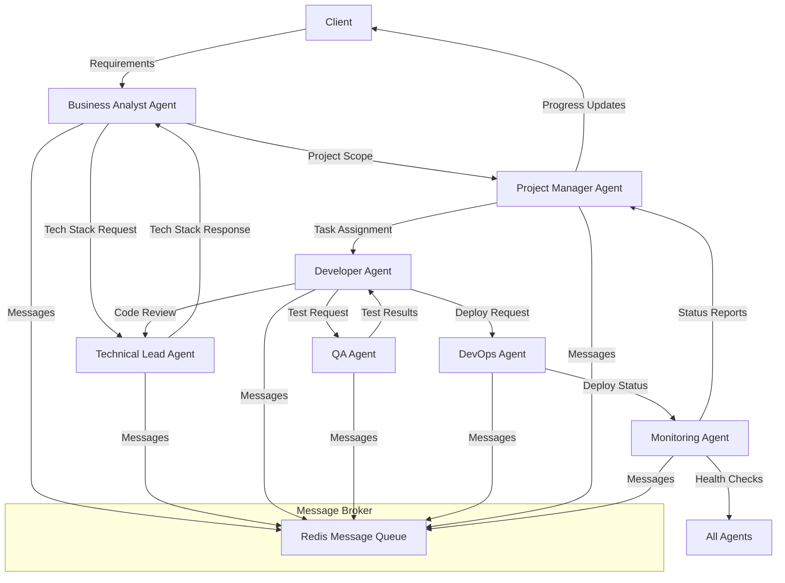
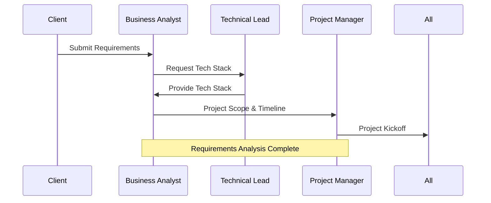
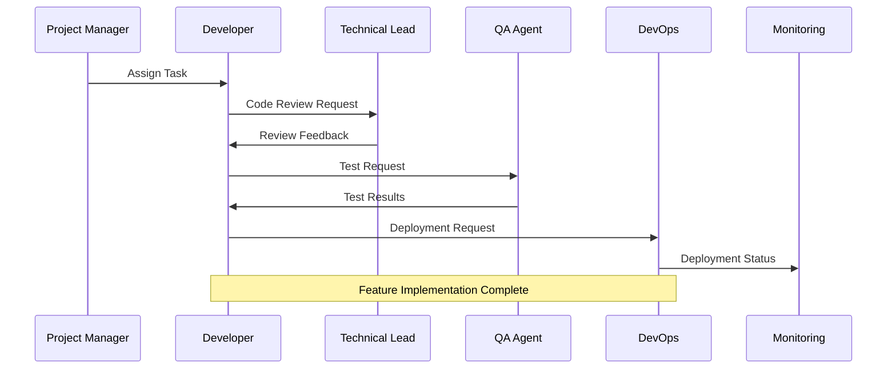
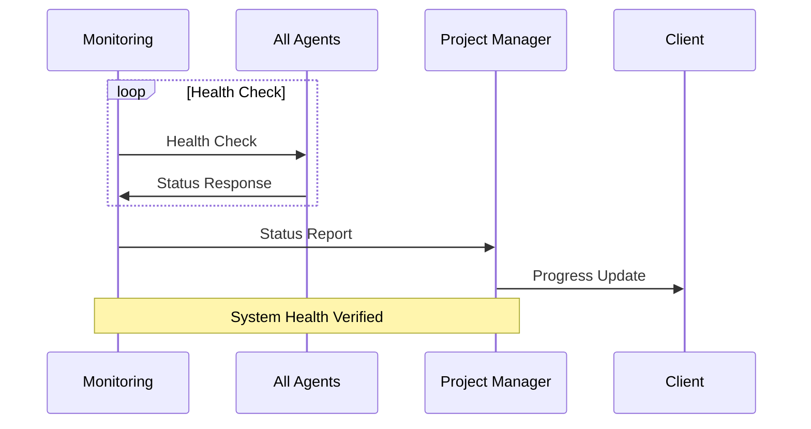
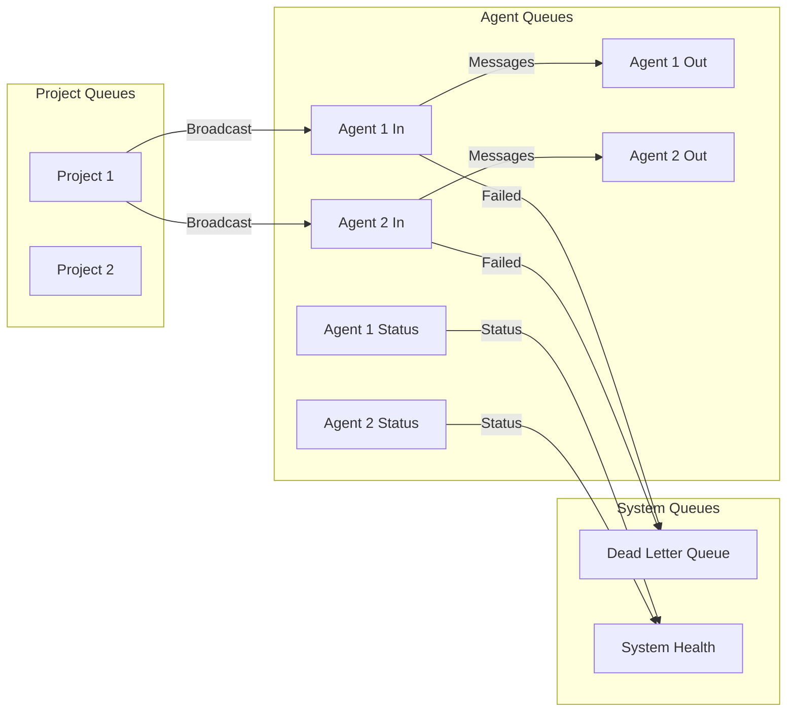

# AISE Workflow and Agent Communication

## System Architecture Overview



## Agent Communication Flow

### 1. Project Initiation Phase



### 2. Development Phase



### 3. Monitoring Phase



## Message Queue Architecture



## Agent Types and Responsibilities

1. **Business Analyst (BA) Agent**
   - Analyzes requirements
   - Creates user stories
   - Identifies risks and constraints
   - Generates project scope

2. **Technical Lead (TL) Agent**
   - Selects technology stack
   - Designs architecture
   - Sets coding standards
   - Reviews code

3. **Developer (DEV) Agent**
   - Implements features
   - Writes unit tests
   - Creates pull requests
   - Fixes bugs

4. **Tester (QA) Agent**
   - Creates test cases
   - Executes automated tests
   - Reports bugs
   - Validates fixes

5. **DevOps (OPS) Agent**
   - Sets up CI/CD pipelines
   - Manages infrastructure
   - Handles deployments
   - Monitors systems

6. **Project Manager (PM) Agent**
   - Tracks progress
   - Manages timelines
   - Coordinates between agents
   - Reports status

7. **Monitoring (MON) Agent**
   - Monitors agent health
   - Tracks system performance
   - Alerts on issues
   - Maintains logs

## Message Types

### 1. Task Messages
- `task_assignment`: Assign work to an agent
- `task_completion`: Notify task completion
- `task_update`: Update task progress
- `task_blocked`: Report blocking issues

### 2. Review Messages
- `code_review_request`: Request code review
- `review_feedback`: Provide review feedback
- `review_approval`: Approve changes
- `review_rejection`: Reject changes

### 3. Test Messages
- `test_request`: Request testing
- `test_results`: Report test results
- `bug_report`: Report found issues
- `fix_verification`: Verify bug fixes

### 4. Deployment Messages
- `deploy_request`: Request deployment
- `deploy_status`: Report deployment status
- `rollback_request`: Request rollback
- `environment_update`: Update environment

### 5. Monitoring Messages
- `health_check`: Check agent health
- `status_report`: Report current status
- `alert`: Send alert for issues
- `log_update`: Update system logs

## Message Queue System

AISE uses Redis as a message broker for agent communication. Each agent has:
- Input queue: Receives messages
- Output queue: Sends messages
- Status queue: Reports status updates

### Queue Structure
```
aise:agent:{agent_id}:in      # Input queue
aise:agent:{agent_id}:out     # Output queue
aise:agent:{agent_id}:status  # Status queue
aise:project:{project_id}     # Project-specific queue
```

## Error Handling

1. **Message Retry**
   - Failed messages are retried 3 times
   - After 3 failures, message goes to dead letter queue

2. **Agent Recovery**
   - Failed agents are restarted automatically
   - State is preserved through checkpoints
   - Tasks are reassigned if needed

3. **System Recovery**
   - Critical failures trigger system-wide alerts
   - Backup agents can take over
   - System state is regularly backed up

## Security

1. **Message Authentication**
   - All messages are signed
   - Message integrity is verified
   - Timestamps prevent replay attacks

2. **Access Control**
   - Role-based access control
   - Project isolation
   - Secure communication channels

## Monitoring and Logging

1. **Agent Monitoring**
   - Health checks every 60 seconds
   - Resource usage tracking
   - Performance metrics

2. **System Logging**
   - All messages are logged
   - Audit trails for all actions
   - Error tracking and reporting

## Example Communication Flow

### New Project Request
1. Client submits requirements
2. BA Agent analyzes requirements
3. BA Agent requests tech stack from TL Agent
4. TL Agent provides technology recommendations
5. BA Agent creates project scope
6. PM Agent creates timeline and assigns tasks
7. Development begins

### Code Change Request
1. DEV Agent completes task
2. DEV Agent creates pull request
3. TL Agent reviews code
4. QA Agent tests changes
5. OPS Agent deploys to test environment
6. MON Agent verifies deployment
7. Changes are approved for production

## Best Practices

1. **Message Handling**
   - Keep messages concise
   - Include all necessary context
   - Use appropriate message types
   - Handle errors gracefully

2. **Agent Coordination**
   - Maintain clear responsibilities
   - Avoid message flooding
   - Use appropriate timeouts
   - Implement backoff strategies

3. **System Maintenance**
   - Regular health checks
   - Performance monitoring
   - Capacity planning
   - Regular updates 