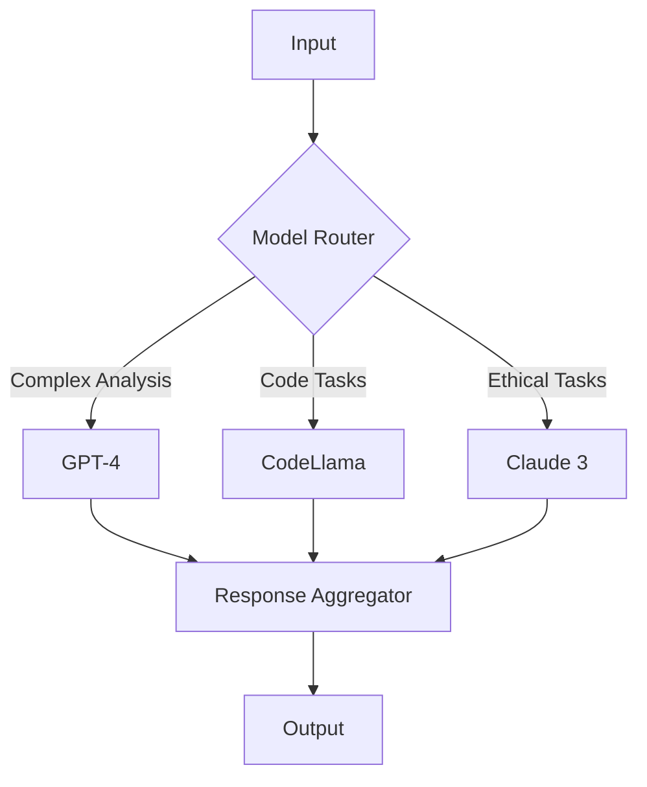

# AISE AI Model Selection Strategy

## Model Selection Criteria

1. **Task-Specific Performance**
   - Accuracy in domain-specific tasks
   - Response quality and relevance
   - Context understanding

2. **Resource Efficiency**
   - Computational requirements
   - Memory usage
   - Response time

3. **Cost Considerations**
   - API costs
   - Infrastructure costs
   - Maintenance costs

4. **Integration Capabilities**
   - API availability
   - Customization options
   - Scalability

## Agent-Specific Model Selection

### 1. Business Analyst (BA) Agent
**Primary Tasks:**
- Requirements analysis
- Market research
- Competitor analysis
- Risk assessment

**Recommended Models:**
1. **GPT-4 (OpenAI)**
   - Best for: Requirements analysis, market research
   - Strengths: Deep understanding, comprehensive analysis
   - Use Case: Initial requirements gathering and analysis

2. **Claude 3 (Anthropic)**
   - Best for: Risk assessment, competitor analysis
   - Strengths: Ethical considerations, detailed analysis
   - Use Case: Risk assessment and mitigation planning

### 2. Technical Lead (TL) Agent
**Primary Tasks:**
- Architecture design
- Technology selection
- Security planning
- Performance optimization

**Recommended Models:**
1. **GPT-4 (OpenAI)**
   - Best for: Architecture design, technology selection
   - Strengths: Technical knowledge, pattern recognition
   - Use Case: System architecture and technology stack decisions

2. **CodeLlama (Meta)**
   - Best for: Code review, security analysis
   - Strengths: Code understanding, security patterns
   - Use Case: Security implementation and code review

### 3. Developer (DEV) Agent
**Primary Tasks:**
- Code implementation
- Bug fixing
- Performance optimization
- Integration work

**Recommended Models:**
1. **Claude 3 (Anthropic)**
   - Best for: Code implementation, bug fixing
   - Strengths: Code generation, problem-solving
   - Use Case: Feature implementation and bug fixes

2. **CodeLlama (Meta)**
   - Best for: Code optimization, integration
   - Strengths: Code understanding, optimization
   - Use Case: Performance optimization and integration

### 4. QA Agent
**Primary Tasks:**
- Test case generation
- Bug detection
- Performance testing
- Security testing

**Recommended Models:**
1. **GPT-4 (OpenAI)**
   - Best for: Test case generation, bug detection
   - Strengths: Scenario understanding, edge case identification
   - Use Case: Test case generation and bug analysis

2. **Claude 3 (Anthropic)**
   - Best for: Security testing, performance analysis
   - Strengths: Security awareness, performance optimization
   - Use Case: Security and performance testing

### 5. DevOps (OPS) Agent
**Primary Tasks:**
- Infrastructure setup
- Deployment automation
- Monitoring setup
- Performance optimization

**Recommended Models:**
1. **GPT-4 (OpenAI)**
   - Best for: Infrastructure design, deployment planning
   - Strengths: System architecture, automation
   - Use Case: Infrastructure setup and deployment automation

2. **Claude 3 (Anthropic)**
   - Best for: Monitoring setup, performance optimization
   - Strengths: System monitoring, optimization
   - Use Case: Monitoring and performance optimization

### 6. Monitoring (MON) Agent
**Primary Tasks:**
- System health monitoring
- Performance tracking
- Alert management
- Log analysis

**Recommended Models:**
1. **GPT-4 (OpenAI)**
   - Best for: Log analysis, alert management
   - Strengths: Pattern recognition, anomaly detection
   - Use Case: Log analysis and alert management

2. **Claude 3 (Anthropic)**
   - Best for: Performance tracking, health monitoring
   - Strengths: System understanding, trend analysis
   - Use Case: Performance monitoring and health checks

## Model Integration Strategy

### 1. Primary Model Selection
- GPT-4 for complex analysis and decision-making
- Claude 3 for ethical considerations and detailed work
- CodeLlama for code-specific tasks

### 2. Fallback Models
- GPT-3.5 Turbo for less critical tasks
- Local models for basic operations
- Specialized models for specific domains

### 3. Model Orchestration

## Cost Optimization Strategy

### 1. Model Usage Optimization
- Use appropriate model size for task
- Implement caching for frequent queries
- Batch similar requests
- Use local models when possible

### 2. Resource Management
- Implement rate limiting
- Use model quantization
- Optimize prompt engineering
- Implement fallback mechanisms

## Implementation Plan

### Phase 1: Model Integration
1. Set up primary models (GPT-4, Claude 3)
2. Implement model routing
3. Set up monitoring and logging

### Phase 2: Optimization
1. Implement caching
2. Set up fallback mechanisms
3. Optimize resource usage

### Phase 3: Scaling
1. Implement load balancing
2. Set up auto-scaling
3. Optimize cost management

## Success Metrics
1. Response accuracy
2. Response time
3. Resource utilization
4. Cost efficiency
5. Error rate 