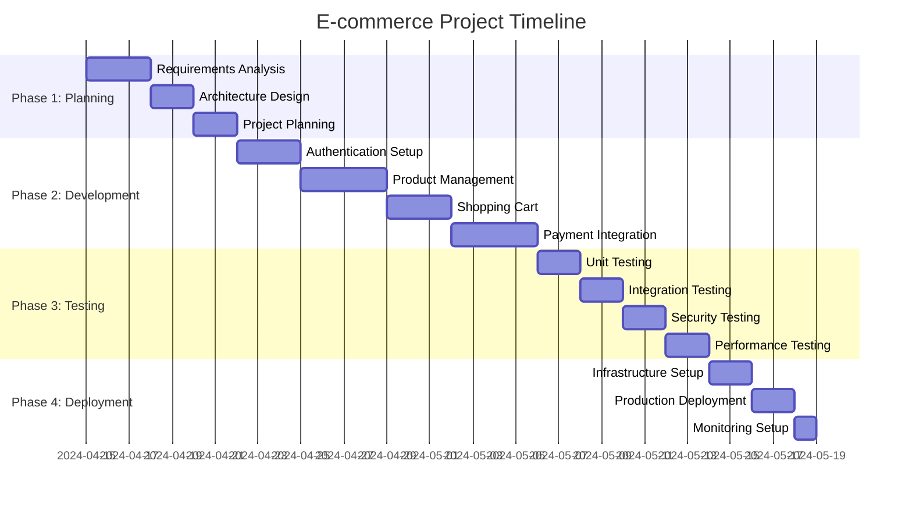

# E-commerce Project Plan

## Project Timeline Overview

## Work Breakdown Structure (WBS)

### 1. Planning Phase (1 Week)
#### 1.1 Requirements Analysis
- Market research
- Competitor analysis
- Feature prioritization
- Security requirements
- Performance requirements

#### 1.2 Architecture Design
- System architecture
- Database design
- API design
- Security architecture
- Deployment architecture

#### 1.3 Project Planning
- Timeline estimation
- Resource allocation
- Risk assessment
- Cost estimation
- Milestone definition

### 2. Development Phase (2 Weeks)
#### 2.1 Authentication System (3 days)
- Google OAuth integration
- User management
- Session handling
- Security implementation

#### 2.2 Product Management (4 days)
- Product CRUD operations
- Image handling
- Search functionality
- Category management

#### 2.3 Shopping Cart (3 days)
- Cart functionality
- State management
- Persistence layer
- User experience

#### 2.4 Payment Integration (4 days)
- Stripe integration
- Order processing
- Payment flow
- Error handling

### 3. Testing Phase (1 Week)
#### 3.1 Unit Testing (2 days)
- Component testing
- API testing
- Integration testing
- Edge case testing

#### 3.2 Security Testing (2 days)
- Authentication testing
- Authorization testing
- Data protection
- Payment security

#### 3.3 Performance Testing (2 days)
- Load testing
- Response time testing
- Database performance
- Cache effectiveness

### 4. Deployment Phase (1 Week)
#### 4.1 Infrastructure Setup (2 days)
- Server provisioning
- Database setup
- Cache configuration
- Load balancing

#### 4.2 Production Deployment (2 days)
- Application deployment
- Database migration
- Configuration setup
- DNS configuration

#### 4.3 Monitoring Setup (1 day)
- Logging configuration
- Alert setup
- Performance monitoring
- Security monitoring

## Client Deliverables

### Week 1: Planning Deliverables
1. Project Requirements Document
2. System Architecture Diagram
3. Database Schema
4. API Documentation
5. Project Timeline
6. Cost Estimation

### Week 2-3: Development Deliverables
1. Authentication System Demo
2. Product Management Demo
3. Shopping Cart Demo
4. Payment Integration Demo
5. Weekly Progress Reports

### Week 4: Testing Deliverables
1. Test Results Report
2. Security Assessment
3. Performance Metrics
4. Bug Fix Report

### Week 5: Deployment Deliverables
1. Production Environment
2. Monitoring Dashboard
3. User Documentation
4. Maintenance Guide

## Risk Assessment

### Technical Risks
1. **Payment Integration Issues**
   - Impact: High
   - Mitigation: Early integration testing
   - Contingency: Alternative payment provider

2. **Performance Bottlenecks**
   - Impact: Medium
   - Mitigation: Regular performance testing
   - Contingency: Scaling infrastructure

3. **Security Vulnerabilities**
   - Impact: High
   - Mitigation: Regular security audits
   - Contingency: Security patches

### Business Risks
1. **Timeline Slippage**
   - Impact: Medium
   - Mitigation: Buffer in timeline
   - Contingency: Prioritize MVP features

2. **Cost Overruns**
   - Impact: Medium
   - Mitigation: Regular cost reviews
   - Contingency: Adjust scope

## Client Communication Plan

### Weekly Updates
1. Progress Report
2. Demo Sessions
3. Risk Updates
4. Timeline Review

### Milestone Reviews
1. Planning Phase Review
2. Development Phase Review
3. Testing Phase Review
4. Deployment Review

## Contract Considerations

### Deliverables
1. Source Code
2. Documentation
3. Deployment Scripts
4. Test Suites

### Payment Schedule
1. 20% - Project Initiation
2. 30% - Development Phase
3. 30% - Testing Phase
4. 20% - Final Delivery

### Support Period
1. 30 days post-deployment
2. Bug fixes
3. Minor enhancements
4. Performance optimization

## Success Criteria
1. All core features implemented
2. Security requirements met
3. Performance targets achieved
4. Successful deployment
5. Client acceptance 