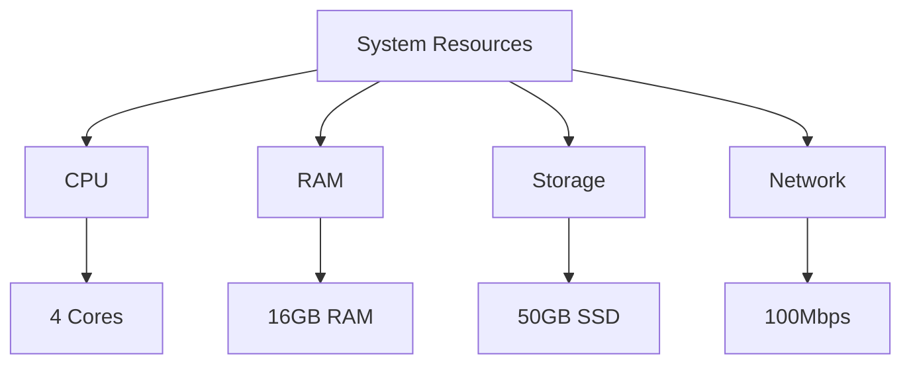

# AISE System Requirements

## Minimum Requirements


## Resource Requirements Breakdown

### 1. CPU Requirements
- **Minimum**: 4 cores @ 2.5GHz
- **Recommended**: 8 cores @ 3.0GHz
- **Usage Breakdown**:
  - Model Inference: 2-4 cores
  - Database Operations: 1-2 cores
  - Message Queue: 1-2 cores
  - System Processes: 1-2 cores

### 2. RAM Requirements
- **Minimum**: 16GB
- **Recommended**: 32GB
- **Usage Breakdown**:
  - AI Models: 8-12GB
  - Database: 4-6GB
  - Message Queue: 2-4GB
  - System: 2-4GB

### 3. Storage Requirements
- **Minimum**: 50GB SSD
- **Recommended**: 100GB SSD
- **Usage Breakdown**:
  - System: 20GB
  - Database: 20GB
  - Models: 10GB
  - Logs: 10GB
  - Cache: 10GB

### 4. Network Requirements
- **Minimum**: 100Mbps
- **Recommended**: 1Gbps
- **Usage Breakdown**:
  - Model API Calls: 50Mbps
  - Database Sync: 25Mbps
  - System Updates: 25Mbps

## Resource Monitoring Tools

### Windows
```powershell
# Check CPU and Memory
Get-Counter '\Processor(_Total)\% Processor Time'
Get-Counter '\Memory\Available MBytes'

# Check Disk Space
Get-PSDrive C | Select-Object Used,Free

# Check Network
Get-NetAdapterStatistics
```

### Linux/Mac
```bash
# Check CPU and Memory
top
htop
free -h

# Check Disk Space
df -h
du -sh *

# Check Network
iftop
nload
```

## Resource Optimization Tips

### 1. CPU Optimization
- Use process affinity
- Implement load balancing
- Optimize model inference
- Use batch processing

### 2. Memory Optimization
- Implement caching
- Use memory-efficient data structures
- Regular garbage collection
- Monitor memory leaks

### 3. Storage Optimization
- Implement data compression
- Regular cleanup of logs
- Use efficient file formats
- Implement caching

### 4. Network Optimization
- Use connection pooling
- Implement request batching
- Use compression
- Cache API responses

## Cloud Deployment Options

### 1. AWS
- EC2: t3.xlarge (4 vCPU, 16GB RAM)
- RDS: db.t3.medium
- ElastiCache: cache.t3.medium

### 2. GCP
- Compute Engine: e2-standard-4
- Cloud SQL: db-standard-1
- Memorystore: basic-tier

### 3. Azure
- Virtual Machine: D4s v3
- Azure SQL: Standard S1
- Azure Cache: Basic C1

## Local Development Setup

### 1. Development Environment
- Docker Desktop
- VS Code
- Git
- Node.js/Python

### 2. Required Services
- PostgreSQL
- Redis
- RabbitMQ
- Local AI Models

### 3. Development Tools
- Docker Compose
- Postman
- pgAdmin
- Redis CLI

## Performance Monitoring

### 1. System Metrics
- CPU Usage
- Memory Usage
- Disk I/O
- Network Traffic

### 2. Application Metrics
- Response Time
- Error Rate
- Throughput
- Resource Utilization

### 3. AI Model Metrics
- Inference Time
- Model Accuracy
- Resource Usage
- Error Rate

## Scaling Considerations

### 1. Vertical Scaling
- Increase CPU cores
- Add more RAM
- Upgrade storage
- Improve network

### 2. Horizontal Scaling
- Add more instances
- Implement load balancing
- Use distributed systems
- Implement caching

## Cost Estimation

### 1. Local Development
- Hardware: $0 (existing)
- Software: $0 (open source)
- Maintenance: $0 (self-managed)

### 2. Cloud Deployment
- Compute: $200-500/month
- Database: $100-200/month
- Storage: $50-100/month
- Network: $50-100/month

## Success Criteria
1. System stability
2. Resource utilization
3. Performance metrics
4. Cost efficiency
5. Scalability 