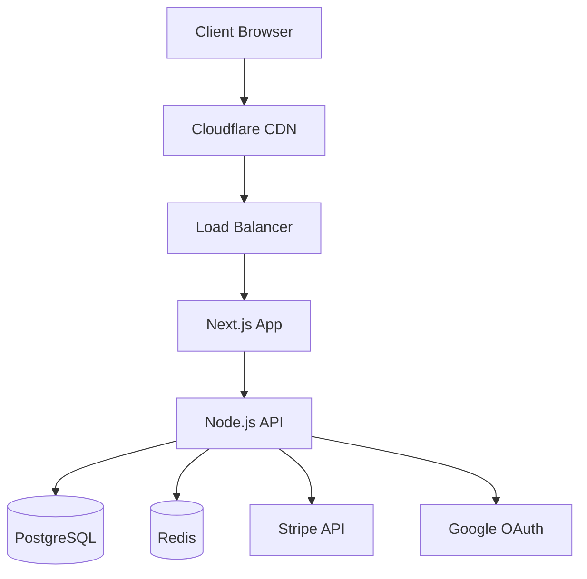

# E-commerce Platform Technical Specification

## System Architecture

### High-Level Architecture


## Component Details

### 1. Frontend (Next.js)
- **Pages**
  - `/` - Home/Product Listing
  - `/products/[id]` - Product Details
  - `/cart` - Shopping Cart
  - `/checkout` - Checkout Process
  - `/auth` - Authentication

- **Components**
  - ProductCard
  - CartItem
  - CheckoutForm
  - AuthButton
  - SearchBar

### 2. Backend (Node.js)
- **API Endpoints**
  ```typescript
  // Authentication
  POST /api/auth/google
  GET /api/auth/me
  
  // Products
  GET /api/products
  GET /api/products/:id
  GET /api/products/search
  
  // Cart
  GET /api/cart
  POST /api/cart
  PUT /api/cart/:id
  DELETE /api/cart/:id
  
  // Checkout
  POST /api/checkout
  GET /api/orders/:id
  ```

### 3. Database Schema
```sql
-- Users
CREATE TABLE users (
    id UUID PRIMARY KEY,
    email VARCHAR(255) UNIQUE,
    name VARCHAR(255),
    google_id VARCHAR(255),
    created_at TIMESTAMP
);

-- Products
CREATE TABLE products (
    id UUID PRIMARY KEY,
    name VARCHAR(255),
    description TEXT,
    price DECIMAL(10,2),
    image_url VARCHAR(255),
    stock INTEGER,
    created_at TIMESTAMP
);

-- Cart
CREATE TABLE cart_items (
    id UUID PRIMARY KEY,
    user_id UUID REFERENCES users(id),
    product_id UUID REFERENCES products(id),
    quantity INTEGER,
    created_at TIMESTAMP
);

-- Orders
CREATE TABLE orders (
    id UUID PRIMARY KEY,
    user_id UUID REFERENCES users(id),
    total_amount DECIMAL(10,2),
    status VARCHAR(50),
    stripe_payment_id VARCHAR(255),
    created_at TIMESTAMP
);
```

## Security Implementation

### 1. Authentication
- Google OAuth 2.0
- JWT for session management
- Secure cookie handling
- CSRF protection

### 2. Data Protection
- HTTPS/TLS
- Data encryption at rest
- Secure password hashing
- Input validation

### 3. Payment Security
- PCI DSS compliance
- Stripe Elements integration
- Secure payment processing
- Fraud detection

## Performance Optimization

### 1. Frontend
- Static page generation
- Image optimization
- Code splitting
- Client-side caching

### 2. Backend
- API response caching
- Database query optimization
- Connection pooling
- Rate limiting

### 3. Infrastructure
- CDN for static assets
- Load balancing
- Auto-scaling
- Database replication

## Monitoring Setup

### 1. Application Monitoring
- Error tracking
- Performance metrics
- User analytics
- Security alerts

### 2. Infrastructure Monitoring
- Server health
- Database performance
- Cache hit rates
- Network latency

## Deployment Strategy

### 1. Development
- Local development environment
- Docker containers
- Hot reloading
- Test automation

### 2. Staging
- Automated testing
- Performance testing
- Security scanning
- User acceptance testing

### 3. Production
- Blue-green deployment
- Zero-downtime updates
- Rollback capability
- Backup strategy

## Cost Optimization

### 1. Infrastructure
- Auto-scaling based on demand
- Reserved instances
- CDN caching
- Database optimization

### 2. Development
- Code optimization
- Resource usage monitoring
- Cost-effective services
- Regular cost reviews

## Implementation Timeline

### Week 1
- Project setup
- Authentication implementation
- Basic product management

### Week 2
- Shopping cart implementation
- Stripe integration
- Basic testing

### Week 3
- Performance optimization
- Security implementation
- Deployment preparation

### Week 4
- Final testing
- Production deployment
- Monitoring setup 