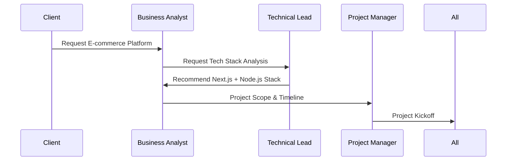
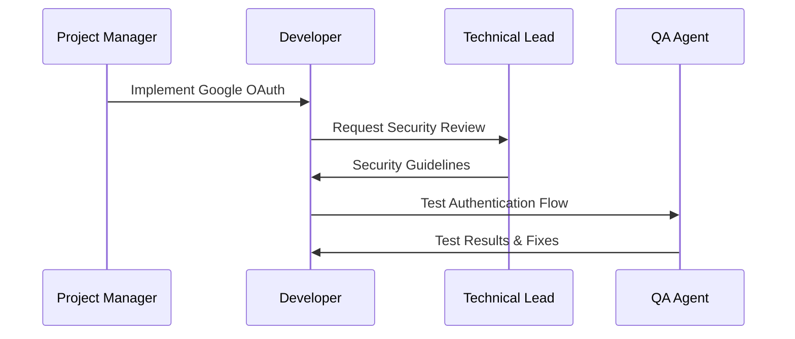
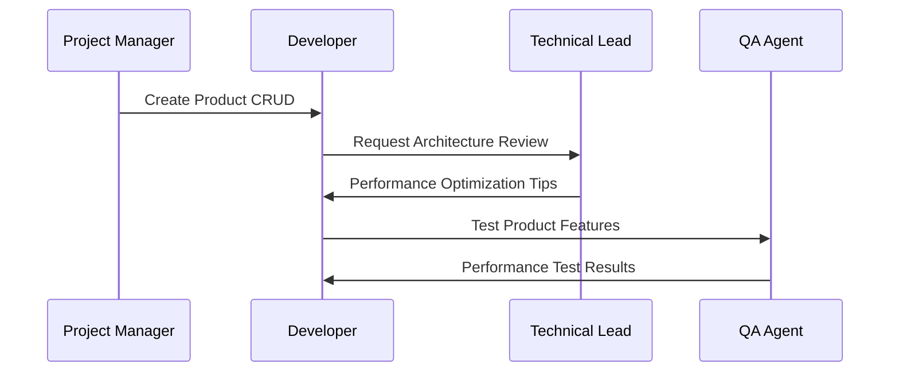
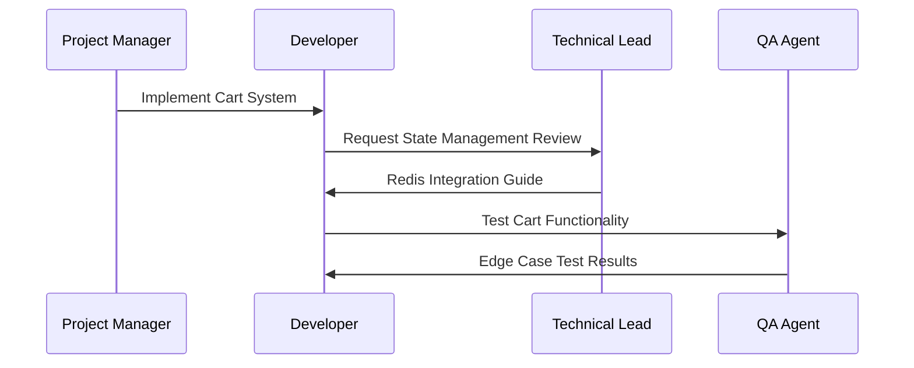
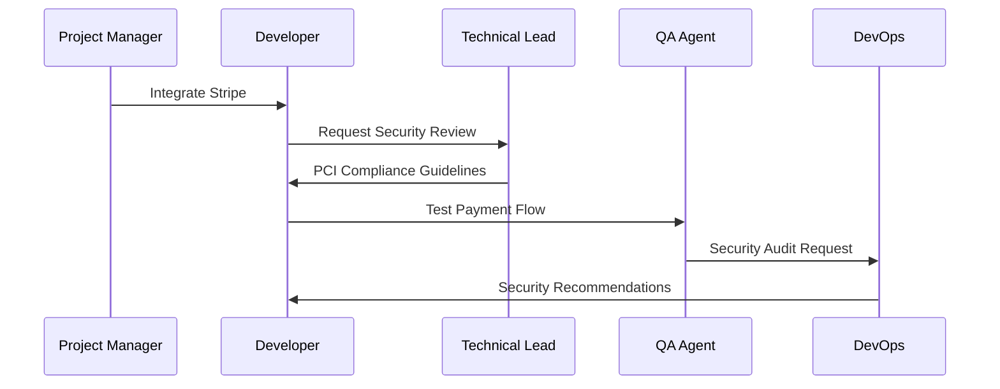
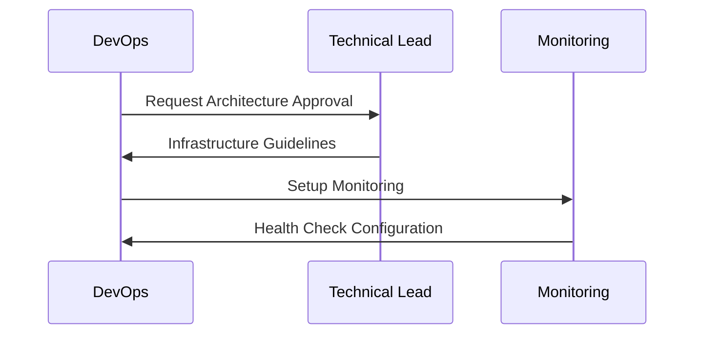
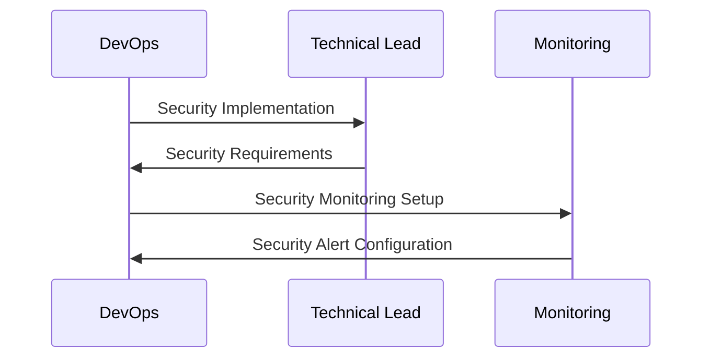
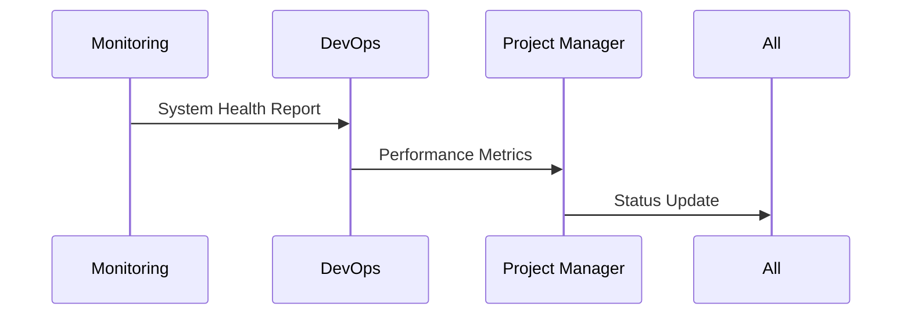

# E-commerce Project Agent Workflow

## Initial Project Setup

## Development Phase

### 1. Authentication System Setup

### 2. Product Management

### 3. Shopping Cart Implementation

### 4. Payment Integration

## Deployment Phase

### 1. Infrastructure Setup

### 2. Security Implementation

## Monitoring Phase

### 1. System Health

## Agent Responsibilities

### Business Analyst (BA) Agent
- Define MVP features
- Analyze market requirements
- Document user stories
- Identify key metrics

### Technical Lead (TL) Agent
- Design system architecture
- Define security measures
- Set coding standards
- Review technical decisions

### Developer (DEV) Agent
- Implement features
- Write unit tests
- Fix bugs
- Optimize performance

### QA Agent
- Create test cases
- Execute tests
- Report bugs
- Verify fixes

### DevOps (OPS) Agent
- Set up infrastructure
- Configure CI/CD
- Manage deployments
- Handle scaling

### Monitoring (MON) Agent
- Track system health
- Monitor performance
- Alert on issues
- Generate reports

## Communication Channels

### Message Types
1. **Task Messages**
   - `feature_implementation`
   - `code_review`
   - `security_audit`
   - `performance_test`

2. **Status Messages**
   - `development_update`
   - `test_results`
   - `deployment_status`
   - `health_check`

3. **Alert Messages**
   - `security_alert`
   - `performance_alert`
   - `error_alert`
   - `system_alert`

## Success Criteria
1. All core features implemented
2. Security requirements met
3. Performance targets achieved
4. Successful deployment
5. Monitoring system active 